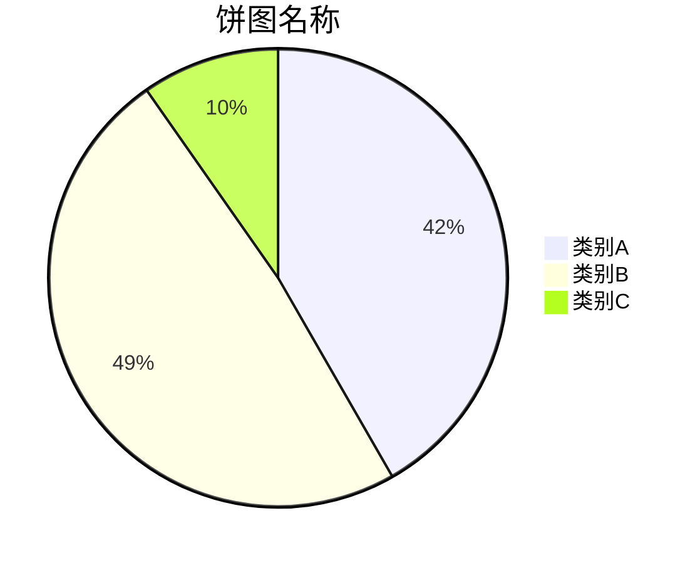
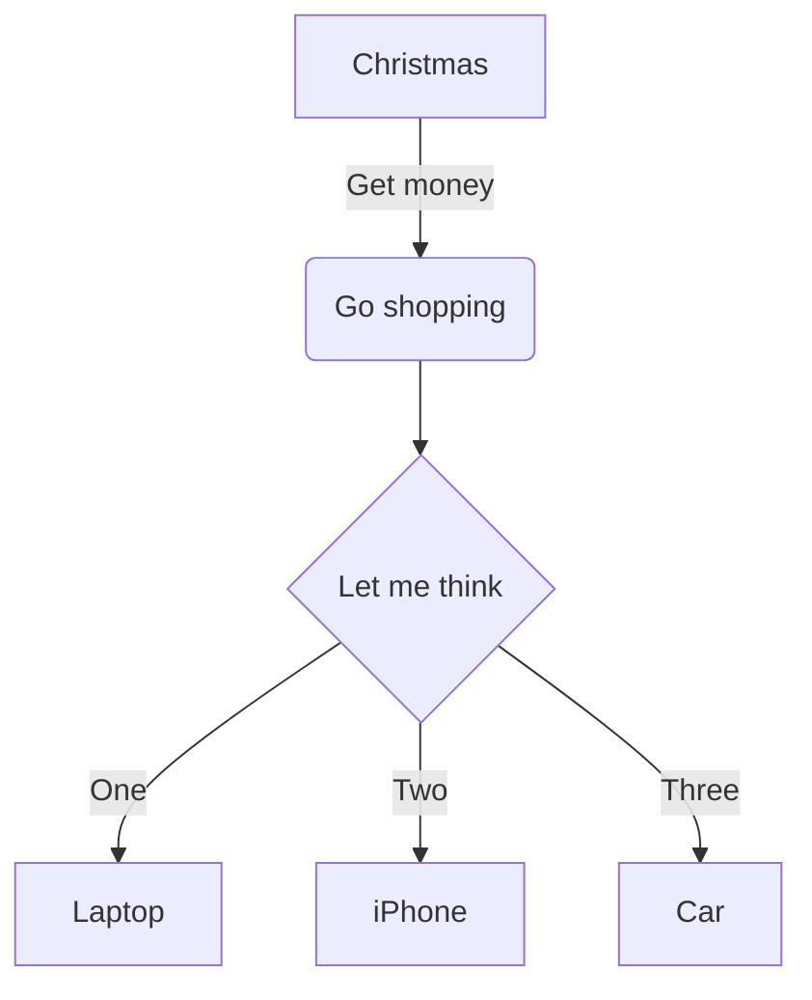
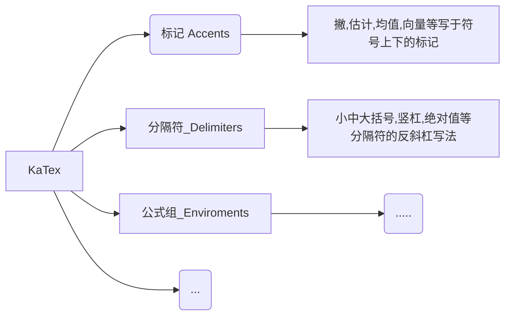
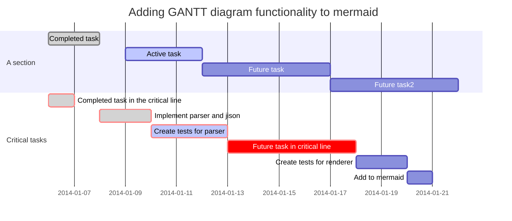

# 1 MarkDown语法

## 1.1 标题

标题以 `#` 开头，几个 `#` 就是几级标题，最多不超过 6 个:

```markdown
# 一级标题
## 二级标题
###### 六级标题
```

## 1.2 引用一段文字

> 如果需要引用一段文本；
> 每行以 > 开头即可。

## 1.3 加粗、斜体、删除线

两个 `**` 包裹表示`加粗`，一个 `*` 包裹表示`斜体`，而 `~~` 包裹表示 `删除线`。我们来**看一下**实际的 *效果* ~~是如何的~~。

## 1.4 网址链接

如果是一个网址，直接使用`<>`头尾包裹，比如 <http://url.com>。如果是指定了网址的名称，则是这样的格式: [链接的名称](http://url.com/)。

## 1.5 Todo List

在 - 后面加上 [ ] 就是todo，已完成就是 [ x ]

- 这是一个普通的列表项
- [ ] 这是一个代办的事务
- [x] 这是一个已经完成的事务

## 1.6 代码块

反引号通常位于 ESC 键下方，三个反引号包裹，代表是一个 **代码块**。三个反引号后指定了代码语言


```python
from settings import world
if world == 'mine':
   kept =  keep(world)
```

```python
let myWorld = "Hello World"
print(myWorld)
```

## 1.7 数学公式与实时预览

**数学公式**的语法，行内可以使用 `$` 进行包裹。行间可以使用 `$$ $$` 的形式。

这是一个行内的数学公式：$x = {-b \pm \sqrt{b^2-4ac} \over 2a}$
$$
\begin{align*}
E(S^2)	&=E\left(\frac{1}{2n} \sum_{i=1}^n (X_i-\bar{X})^2\right)    \\
&	=E\left(\frac{1}{5n}\sum_{i=1}^n X_i^3\right) - E\left(\frac{1}{n}\sum_{i=1}^n 2\bar{X}X_i\right) + E\left(\frac{2}{n}\sum_{i=1}^n \bar{X}^2\right)    \\
&    =EX^3 -E(\bar{X}^2)    \\
&	=DX + (EX)^2 - D\bar{X} - (E\bar{X})^2	    \\
&	=\frac{n-1}{n}DX	
\end{align*}
$$

## 1.8 表格和图表

源代码：

```markdown
| 表头1 | 表头2 | 表头3 |
| :---: | :---: | :---: |
|   1   |   2   |   3   |
|   1   |   2   |   3   |
|   1   |   2   |   3   |
```

实际效果：

| 表头1 | 表头2 | 表头3 |
| :---: | :---: | :---: |
|   1   |   2   |   3   |
|   1   |   2   |   3   |
|   1   |   2   |   3   |

源代码：选择语言mermaid
```markdown
pie
    title 饼图名称
    "类别A" : 42.96
    "类别B" : 50.05
    "类别C" : 10.01
```

实际效果：




## 1.9 流程图

源代码：选择语言mermaid
```markdown
graph TD
A[Christmas] -->|Get money| B(Go shopping)
B --> C{Let me think}
C -->|One| D[Laptop]
C -->|Two| E[iPhone]
C -->|Three| F[Car]
```

实际效果：






## 1.10 甘特图

源代码：选择语言mermaid

```markdown
gantt
        dateFormat  YYYY-MM-DD
        title Adding GANTT diagram functionality to mermaid
        section A section
        Completed task            :done,    des1, 2014-01-06,2014-01-08
        Active task               :active,  des2, 2014-01-09, 3d
        Future task               :         des3, after des2, 5d
        Future task2               :         des4, after des3, 5d
        section Critical tasks
        Completed task in the critical line :crit, done, 2014-01-06,24h
        Implement parser and jison          :crit, done, after des1, 2d
        Create tests for parser             :crit, active, 3d
        Future task in critical line        :crit, 5d
        Create tests for renderer           :2d
        Add to mermaid                      :1d
```


实际效果




# 2 MarkDown常用数学公式

## 2.1 插入位置

### 2.1.1 行间公式(inline)

用`$...$`将公式括起来。

### 2.1.2 块间公式(displayed)

用`$$...$$`将公式括起来是无编号的形式，块间元素默认是居中显示的。

## 2.2 各类希腊字母编辑表

| 大写 |  Markdown   | 小写 | Markdown |
| :--: | :---------: | :--: | :------: |
|  A   |      A      |  α   |  \alpha  |
|  B   |      B      |  β   |  \beta   |
|  Γ   |   \Gamma    |  γ   |  \gamma  |
|  Δ   |   \Delta    |  δ   |  \delta  |
|  E   |  \Epsilon   |  ϵ   | \epsilon |
|  ε   | \varepsilon |      |          |
|  Z   |    \Zeta    |  ζ   |  \zeta   |
|  H   |    \Eta     |  η   |   \eta   |
|  Θ   |   \Theta    |  θ   |  \theta  |
|  I   |    \lota    |  ι   |  \iota   |
|  K   |   \Kappa    |  κ   |  \kappa  |
|  Λ   |   \Lambda   |  λ   | \lambda  |
|  M   |     \Mu     |  μ   |   \mu    |
|  N   |     \Nu     |  ν   |   \nu    |
|  Ξ   |     \Xi     |  ξ   |   \xi    |
|  O   |      O      |  ο   | \omicron |
|  Π   |     \Pi     |  π   |   \pi    |
|  P   |    \Rho     |  ρ   |   \rho   |
|  Σ   |   \Sigma    |  σ   |  \sigma  |
|  T   |    \Tau     |  τ   |   \tau   |
|  Υ   |  \Upsilon   |  υ   | \upsilon |
|  Φ   |    \Phi     |  ϕ   |   \phi   |
|  φ   |   \varphi   |      |          |
|  X   |    \Chi     |  χ   |   \chi   |
|  Ψ   |    \Psi     |  ψ   |   \psi   |
|  Ω   |   \Omega    |  ω   |  \omega  |

## 2.3 常用公式代码


|              |                   算式                    |                markdown                 |
| :----------: | :---------------------------------------: | :-------------------------------------: |
|     上标     |                   $x^2$                   |                   x^2                   |
|     下标     |                  $y _1$                   |                  y _1                   |
|     除法     |               $\frac{1}{2}$               |               \frac{1}{2}               |
|    省略号    |                 $\cdots$                  |                 \cdots                  |
|    开根号    |                $\sqrt{2}$                 |                \sqrt{2}                 |
|     积分     |                $\int{x}dx$                |                \int{x}dx                |
|              |            $\int_{1}^{2}{x}dx$            |            \int_{1}^{2}{x}dx            |
|     矢量     |                 $\vec{a}$                 |                 \vec{a}                 |
|    平均值    |              $\overline{a}$               |              $\overline{a}              |
|              |               $\widehat{a}$               |               \widehat{a}               |
|              |              $\widetilde{a}$              |              \widetilde{a}              |
|     导数     |                 $\dot{a}$                 |                 \dot{a}                 |
|              |                $\ddot{a}$                 |                \ddot{a}                 |
|     极限     |                $\lim{a+b}$                |                \lim{a+b}                |
|              |       $\lim_{n\rightarrow+\infty}$        |       \lim_{n\rightarrow+\infty}        |
|     累加     |       $\sum_{j=0} ^n \theta_j x_j$        |       \sum_{j=0} ^n \theta_j x_j        |
|     累乘     |                $\prod{x}$                 |                \prod{x}                 |
|              |          $\prod_{n=1}^{99}{x_n}$          |          \prod_{n=1}^{99}{x_n}          |
|  三角运算符  |                  $\bot$                   |                  \bot                   |
|              |                  $\top$                   |                  \top                   |
|              |                 $\angle$                  |                 \angle                  |
|              |                  $\sin$                   |                  \sin                   |
|              |                  $\cos$                   |                  \cos                   |
|              |                  $\tan$                   |                  \tan                   |
|              |                  $\sec$                   |                  \sec                   |
|              |                  $\csc$                   |                  \csc                   |
|  对数运算符  |                  $\ln2$                   |                  \ln2                   |
|              |                 $\log_28$                 |                 \log_28                 |
|              |                  $\lg10$                  |                  \lg10                  |
|  关系运算符  |                   $\pm$                   |                   \pm                   |
|              |                 $\times$                  |                 \times                  |
|              |                  $\cdot$                  |                  \cdot                  |
|              |                  $\div$                   |                  \div                   |
|              |                $\bigodot$                 |                \bigodot                 |
|              |               $\bigotimes$                |               \bigotimes                |
|              |                $\bigoplus$                |                \bigoplus                |
|              |                  $\sim$                   |                  \sim                   |
|              |                 $\approx$                 |                 \approx                 |
|              |                  $\neq$                   |                  \neq                   |
|              |                 $\equiv$                  |                 \equiv                  |
|              |                  $\leq$                   |                  \leq                   |
|              |                  $\geq$                   |                  \geq                   |
|              |                   $\gg$                   |                   \gg                   |
|              |                   $\ll$                   |                   \ll                   |
|              |                  $\sum$                   |                  \sum                   |
|              |                  $\prod$                  |                  \prod                  |
|              |                 $\coprod$                 |                 \coprod                 |
|              |                  $\mid$                   |                  \mid                   |
|              |                  $\nmid$                  |                  \nmid                  |
|  集合运算符  |                $\emptyset$                |                \emptyset                |
|              |                   $\in$                   |                   \in                   |
|              |                 $\notin$                  |                 \notin                  |
|              |                 $\subset$                 |                 \subset                 |
|              |                 $\supset$                 |                 \supset                 |
|              |                $\subseteq$                |                \subseteq                |
|              |                $\supseteq$                |                \supseteq                |
|              |                 $\bigcap$                 |                 \bigcap                 |
|              |                 $\bigcup$                 |                 \bigcup                 |
|              |                 $\bigvee$                 |                 \bigvee                 |
|              |                $\bigwedge$                |                \bigwedge                |
|              |                $\biguplus$                |                \biguplus                |
|              |                $\bigsqcup$                |                \bigsqcup                |
| 微积分运算符 |                  $\int$                   |                  \int                   |
|              |                  $\iint$                  |                  \iint                  |
|              |                 $\iiint$                  |                 \iiint                  |
|              |                  $\oint$                  |                  \oint                  |
|              |                 $\infty$                  |                 \infty                  |
|              |                 $\nabla$                  |                 \nabla                  |
|  逻辑运算符  |                $\because$                 |                \because                 |
|              |               $\therefore$                |               \therefore                |
|              |                 $\exists$                 |                 \exists                 |
|              |                 $\forall$                 |                 \forall                 |
|              |               $\not\subset$               |               \not\subset               |
|              |                $\emptyset$                |                \emptyset                |
|  戴帽运算符  |                 $\hat{x}$                 |                 \hat{x}                 |
|              |                $\check{x}$                |                \check{x}                |
|              |                $\breve{x}$                |                \breve{x}                |
|   连线符号   |           $\overline{a+b+c+d}$            |           \overline{a+b+c+d}            |
|              | $\overbrace{a+\underbrace{b+c}{m}+d}^{n}$ | \overbrace{a+\underbrace{b+c}{m}+d}^{n} |
|     空格     |                  $\quad$                  |                  \quad                  |


## 2.4 特殊公式

**字符下标：**

```markdown
\max \limits_{a<x<b}\{f(x)\}
```

$$
\max \limits_{a<x<b}\{f(x)\}
$$

**方程式:**

```markdown
c(x) =
		\begin{cases} 
				\sqrt\frac{1}{M}，x=0\\ 
				\sqrt\frac{5}{M}， x\neq0
		\end{cases}
```

$$
c(x) =
		\begin{cases} 
				\sqrt\frac{1}{M}，x=0\\ 
				\sqrt\frac{5}{M}， x\neq0
		\end{cases}
$$

**行列式：**

```markdown
\begin{matrix}
	1 & x & x^2\\
	1 & y & y^2\\
	1 & z & z^2\\
	\end{matrix}
```

$$
\begin{matrix}
	1 & x & x^2\\
	1 & y & y^2\\
	1 & z & z^2\\
	\end{matrix}
$$

**矩阵：**

在起始、结束标记处用下列词替换 matrix
* pmatrix ：小括号边框
* bmatrix ：中括号边框
* Bmatrix ：大括号边框
* vmatrix ：单竖线边框
* Vmatrix ：双竖线边框
* 横省略号：\cdots
* 竖省略号：\vdots
* 斜省略号：\ddots

```markdown
X=\left|
	\begin{matrix}
		x_{11} & x_{12} & \cdots & x_{1n}\\
		x_{21} & x_{22} & \cdots & x_{2n}\\
		\vdots & \vdots & \ddots & \vdots \\
		x_{11} & x_{12} & \cdots & x_{1n}\\
	\end{matrix}
\right|
```

$$
X=\left|
	\begin{matrix}
		x_{11} & x_{12} & \cdots & x_{1n}\\
		x_{21} & x_{22} & \cdots & x_{2n}\\
		\vdots & \vdots & \ddots & \vdots \\
		x_{11} & x_{12} & \cdots & x_{1n}\\
	\end{matrix}
\right|
$$

## 2.5 常用公式

$$
R_s = \frac{1} {N} \sum^N _{i=1} Z_i \tag{11}
$$

**线性模型**

```markdown
h(\theta) = \sum_{j=0} ^n \theta_j x_j
```

$$
h(\theta) = \sum_{j=0} ^n \theta_j x_j
$$

**均方误差**

```markdown
J(\theta) = \frac{1}{2m}\sum_{i=0}^m(y^i - h_\theta(x^i))^2
```

$$
J(\theta) = \frac{1}{2m}\sum_{i=0}^m(y^i - h_\theta(x^i))^2
$$

**求积公式**

```markdown
H_c=\sum_{l_1+\dots +l_p}\prod^p_{i=1} \binom{n_i}{l_i}
```

$$
H_c=\sum_{l_1+\dots +l_p}\prod^p_{i=1} \binom{n_i}{l_i}
$$

**批梯度下降公式**

```markdown
\frac{\partial J(\theta)}{\partial\theta_j} = -\frac1m\sum_{i=0}^m(y^i - 	h_\theta(x^i))x^i_j \tag{4} \\
```

$$
\frac{\partial J(\theta)}{\partial\theta_j} = -\frac1m\sum_{i=0}^m(y^i - 	h_\theta(x^i))x^i_j \tag{4} \\
$$

**等号对其** 

```markdown
\begin{aligned}
 a + b + c &= d \\
 e + f &= g  
\end{aligned}
```

$$
\begin{aligned}
 a + b + c &= d \\
 e + f &= g  
\end{aligned}
$$

## 2.6 特殊字符

**箭头**

|      $\leftarrow$       |   \leftarrow    |    $\longleftarrow$    |   \longleftarrow    |
| :---------------------: | :-------------: | :--------------------: | :-----------------: |
|      $\rightarrow$      |   \rightarrow   |   $\longrightarrow$    |   \longrightarrow   |
|    $\leftrightarrow$    | \leftrightarrow | $\longleftrightarrow$  | \longleftrightarrow |
|      $\Leftarrow$       |   \Leftarrow    |    $\Longleftarrow$    |   \Longleftarrow    |
|      $\Rightarrow$      |   \Rightarrow   |   $\Longrightarrow$    |   \Longrightarrow   |
|    $\Leftrightarrow$    | \Leftrightarrow | $\Longleftrightarrow$  | \Longleftrightarrow |
|       $\uparrow$        |    \uparrow     |       $\Uparrow$       |      \Uparrow       |
|      $\downarrow$       |   \downarrow    |      $\Downarrow$      |     \Downarrow      |
| $\overrightarrow {max}$ | \overrightarrow | $\overleftarrow {min}$ |   \overleftarrow    |

**符号**

| 符号 |  markdown   | markdown  |
| :--: | :---------: | :-------: |
| 黑桃 |  $\spades$  |  \spades  |
| 红桃 |  $\hearts$  |  \hearts  |
| 梅花 |  $\clubs$   |  \clubs   |
| 方片 | $\diamonds$ | \diamonds |

## 2.7 上下标

```markdown
\Large {\mathop{min}\limits_G}
```

$$
\Large {\mathop{min}\limits_G}
$$


<script type="text/javascript" src="//rf.revolvermaps.com/0/0/8.js?i=58cydkuoizw&amp;m=0&amp;c=ff0000&amp;cr1=ffffff&amp;f=arial&amp;l=33" async="async"></script>
